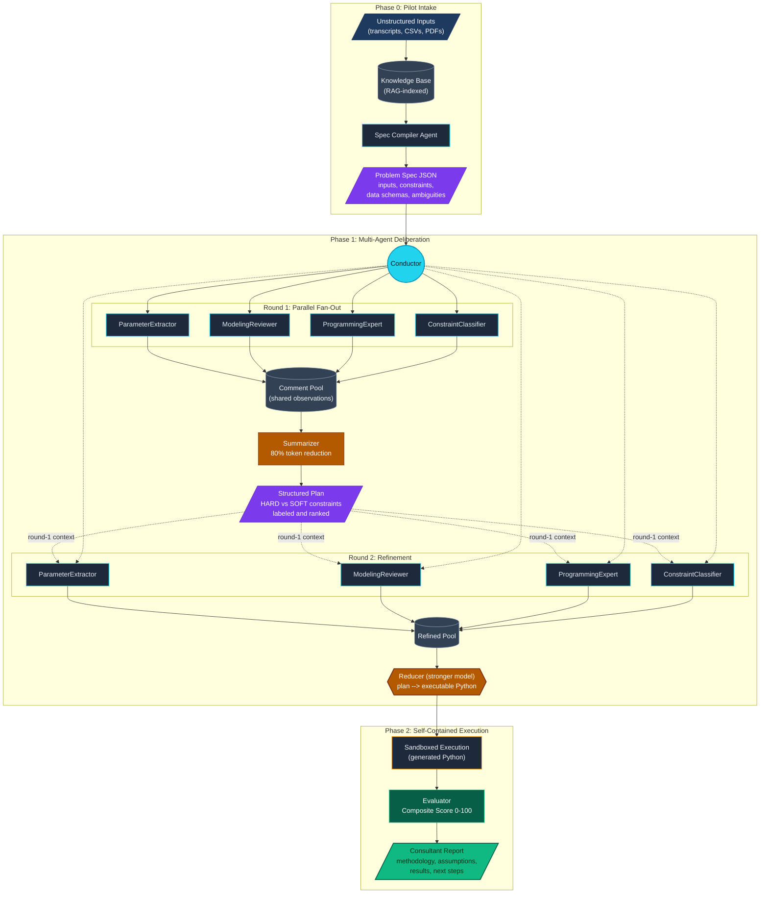

# Op-Era

**Automated optimization deployment through multi-agent deliberation.**

Op-Era is a three-phase pipeline that takes unstructured business problems -- meeting transcripts, data samples, constraint descriptions in plain language -- and produces validated, deployable optimization solutions with full traceability. It compresses what traditionally takes weeks of consulting scoping into minutes of automated reasoning.

Developed as research at MIT Media Lab (MAS.664: AI Agents and Agentic Web).

---

## Architecture

The pipeline is organized into three phases. Phase 0 converts messy real-world inputs into a structured contract. Phase 1 runs multi-agent deliberation to produce a solution plan. Phase 2 executes, scores, and reports.



---

## The Problem Spec: A Contract Between Phases

Phase 0 produces a Problem Spec -- a structured JSON contract that makes every assumption explicit before any optimization code is written. This is what separates Op-Era from "throw the problem at an LLM and hope": the spec forces disambiguation upfront.

```json
{
  "problem_type": "VRPTW with Skill Matching",
  "inputs": {
    "orders": { "count": 349, "schema": ["order_id", "lat", "lng", "service_type", "duration_min", "time_window"] },
    "providers": { "count": 338, "schema": ["provider_id", "lat", "lng", "skills", "availability_windows", "max_radius_km"] }
  },
  "constraints": {
    "hard": [
      { "name": "radius_cap_km", "description": "Provider cannot be assigned orders beyond their max travel radius", "source": "stakeholder interview" },
      { "name": "skill_match", "description": "Provider must possess the skill required by the order" },
      { "name": "time_window_feasibility", "description": "Assignment must respect both order and provider time windows" }
    ],
    "soft": [
      { "name": "travel_minimization", "description": "Prefer geographically closer assignments", "weight": 0.3 },
      { "name": "workload_balance", "description": "Distribute orders evenly across providers", "weight": 0.15 }
    ]
  },
  "discovered_anomalies": [
    "31% of providers work split shifts (unavailable midday) -- must model as multiple windows, not one",
    "14% of orders have hidden additional service durations embedded in notes field"
  ],
  "ambiguities": {
    "resolved": ["radius_cap confirmed as HARD constraint after Round 2 deliberation"],
    "unresolved": ["tie-breaking policy when multiple providers are equidistant"]
  }
}
```

The `discovered_anomalies` field is where the pipeline earns its keep. A human consultant would likely catch the split-shift pattern eventually, but it would take manual data exploration. The pipeline finds it automatically during Phase 0 intake and surfaces it before any model is built.

---

## Deliberation Engine: Experiment Results

The multi-agent deliberation in Phase 1 was tested across 6 configurations, varying the number of agents (3, 6, 10), number of rounds (1, 2), and model backbone. All experiments ran on the same service marketplace problem (349 orders, 338 providers).

| Config | Agents | Rounds | Model | Score | Violations | Insight |
|--------|--------|--------|-------|-------|------------|---------|
| C1 | 3 | 1 | GPT-4.1-mini | 58.1 | 38 radius | Baseline -- agents identify the right approach but misclassify constraint severity |
| C2 | 3 | 2 | GPT-4.1-mini | 76.4 | 0 | Round 2 corrects critical misclassification (radius as SOFT --> HARD) |
| C3 | 6 | 1 | GPT-4.1-mini | 65.1 | 31 | More agents reduce violations vs C1 but don't eliminate them |
| C4 | 6 | 2 | GPT-4.1-mini | 45.6 | 0 | Over-correction: agents collapse to serving 5 of 349 orders to avoid violations |
| C5 | 10 | 1 | GPT-4.1-mini | 68.0 | 11 | Diminishing returns on agent count alone |
| C6 | 10 | 2 (hybrid) | GPT-4.1-mini + Opus | 77.9 | 0 | Matches C2 quality but at 6x API cost |

**The key finding: iteration is dose-dependent.** Round 2 dramatically improves small teams (C1 --> C2: +18.3 points, 38 --> 0 violations). But on larger teams with weaker models, the same mechanism backfires -- agents over-correct each other into pathological conservatism (C3 --> C4: -19.5 points, served orders collapse from 341 to 5). The sweet spot is a small, focused deliberation with a second round for self-correction.

The winning configuration (C2) achieves zero constraint violations with only 9 API calls. C6 matches it with a stronger model backbone but requires 23 calls at 6x the cost, making C2 the clear Pareto-optimal choice.

---

## Scoring System

The Evaluator in Phase 2 produces a composite score on a 0-100 scale, decomposed into four components that reflect what matters in real optimization deployments:

| Component | Max Points | What It Measures |
|-----------|------------|------------------|
| Served demand | 40 | Fraction of orders successfully assigned (the primary business metric) |
| Feasibility | 25 | Zero hard constraint violations (binary: full points or heavy penalty) |
| Travel efficiency | 20 | Total travel distance relative to a theoretical lower bound |
| Regression avoidance | 15 | No individual provider or order is made worse vs. baseline |

The weights reflect a deliberate prioritization: serving demand matters most, but not at the cost of feasibility. A solution that assigns 100% of orders but violates radius constraints scores lower than one that assigns 95% cleanly. The regression component prevents the optimizer from sacrificing individual outcomes for aggregate improvement.

---

## Deployed Case Studies

Op-Era has been validated on two real-world optimization problems with production data.

### [Service Marketplace Optimizer](https://github.com/bchalita/service-marketplace-optimizer)

Order-to-provider assignment for an on-demand beauty services marketplace. 349 orders, 338 providers, VRPTW with skill matching, time windows, and provider radius constraints.

- Unserved demand: 10.6% --> 2.2% (79% reduction)
- Provider travel: -19% average distance
- Orders per provider: +21% (better utilization)
- Approach: greedy construction + local search heuristic, pure Python, no external solvers

### [Retail Last-Mile Optimizer](https://github.com/bchalita/retail-last-mile-optimizer)

Ship-from-store delivery optimization for a retail chain. 15K+ orders across 10 stores, two-level pipeline: heuristic store-to-order assignment followed by MIP route optimization.

- Delivery cost: -38% across all orders
- Route count: -49% through multi-stop consolidation
- On-time rate: 79.7% --> 90.9%
- Approach: Julia (JuMP/Gurobi), Google Maps Distance Matrix API

---

## Repository Structure

```
op-era/
  multi-agent-deliberation/
    orchestrator.py        # Top-level pipeline controller
    conductor.py           # Turn management and agent coordination
    agents.py              # Agent definitions (ParameterExtractor, ModelingReviewer, etc.)
    comment_pool.py        # Shared deliberation context
    reducer.py             # Plan-to-code synthesis (stronger model)
    evaluator.py           # Composite scoring (0-100)
    run.py                 # CLI entry point
    logs/                  # Full deliberation transcripts for all 6 configs
  validation/
    test-problems/         # 19 benchmark OR problems with ground truth solutions
  references.md            # Research papers informing the design
```

---

## Tech Stack

- Python 3.11+
- OpenAI and Anthropic APIs (configurable model backbone per agent)
- PuLP for generated solver code execution
- RAG pipeline for Phase 0 knowledge base indexing

---

## Research Context

Developed at MIT Media Lab as part of research on multi-agent systems for operations research automation. The deliberation engine design draws on recent work in LLM-based optimization (OptiMUS, OptimAI) and extends it with structured multi-round deliberation, explicit constraint classification, and composite scoring with regression safeguards.

See [references.md](references.md) for the full list of papers that informed the architecture.

---

## License

MIT
