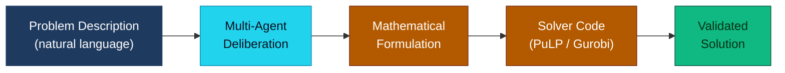

# Op-Era

AI-powered pipeline that converts plain-English business problems into deployed optimization solutions.

## What It Does

Op-Era takes an optimization problem described in natural language — routing, scheduling, assignment, resource allocation — and automatically formulates the mathematical model, generates solver code, and validates the solution. The core engine is a multi-agent deliberation system where specialized AI agents collaboratively reason through the problem.

## Deployed Case Studies

Op-Era has been validated on real-world optimization engagements:

### [Service Marketplace Optimizer](https://github.com/bchalita/service-marketplace-optimizer)
Order-to-provider assignment for on-demand service marketplaces. Greedy + local search heuristic solving a VRPTW with skill matching.
- 79% reduction in unserved demand (10.6% → 2.2%)
- 19% reduction in provider travel distance
- Pure Python, no external solvers

### [Retail Last-Mile Optimizer](https://github.com/bchalita/retail-last-mile-optimizer)
Ship-from-store delivery optimization with a two-level pipeline: heuristic store assignment + MIP routing.
- 38% cost reduction across 15K+ orders
- 49% fewer routes through multi-stop consolidation
- Julia (JuMP/Gurobi), Google Maps Distance Matrix API

## Multi-Agent Deliberation Engine

The [`multi-agent-deliberation/`](multi-agent-deliberation/) directory contains the core engine: 30 AI agents organized into 4 layers (problem understanding, formulation, implementation, meta/quality) that deliberate through structured rounds to solve OR problems.

- Supports OpenAI and Anthropic models — bring your own API key
- 6 tested configurations varying agent count (3, 6, 10), rounds (1, 2), and model choice
- Best result: 3 agents × 2 rounds achieves zero constraint violations at minimal cost
- See the [architecture diagrams](multi-agent-deliberation/ARCHITECTURE.md) for details

## Validation

The [`validation/test-problems/`](validation/test-problems/) directory contains 19 benchmark optimization problems with ground truth solutions, used to evaluate the deliberation engine. Problems span aircraft assignment, cutting stock, diet optimization, flowshop scheduling, knapsack, network flows, and more.

## Tech Stack

- Python, OpenAI / Anthropic APIs
- PuLP for solver code generation and execution
- Evaluated against standard OR benchmarks and real-world pilot data

## Research Context

Developed at MIT Media Lab as part of MAS.664 (AI Agents and Agentic Web). See [references.md](references.md) for the research papers that informed the design.

## License

MIT
