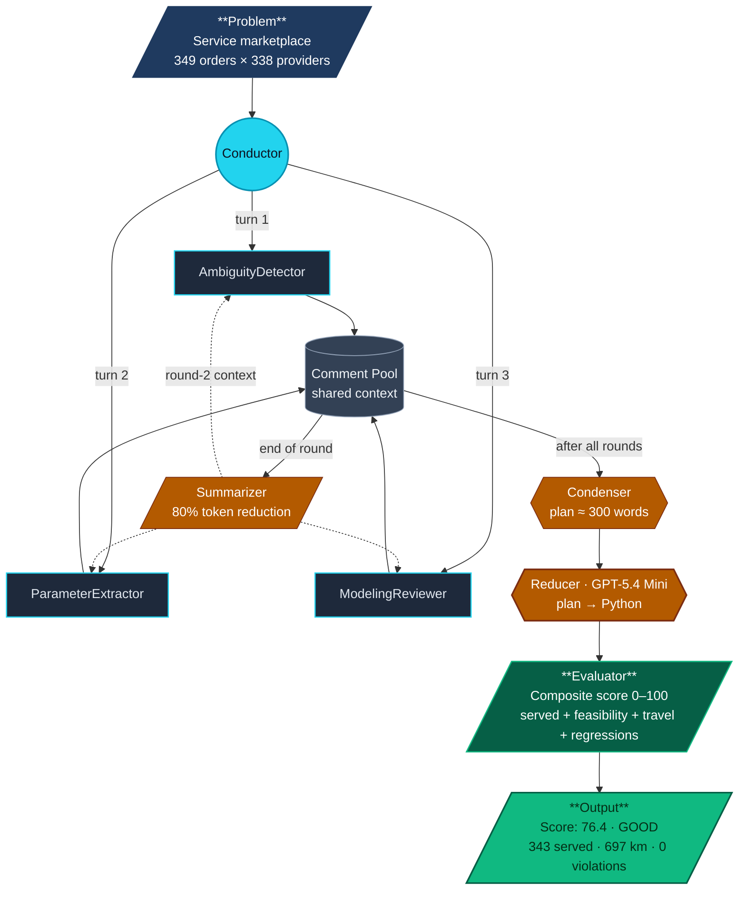
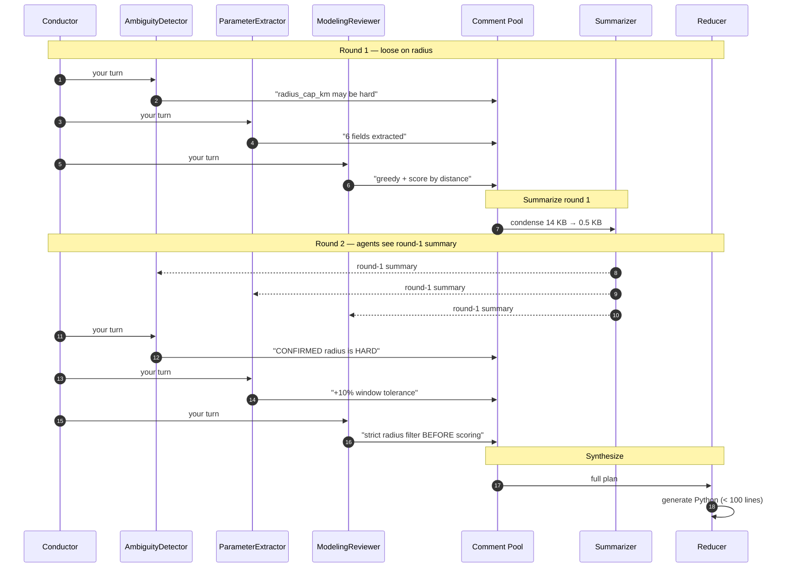
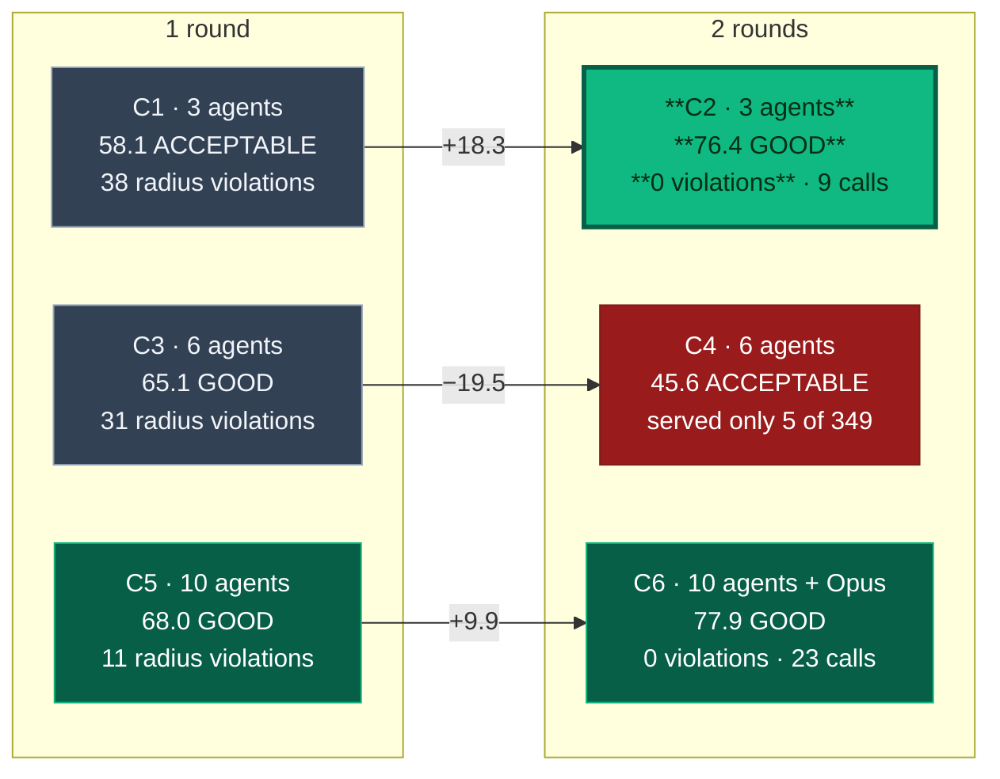
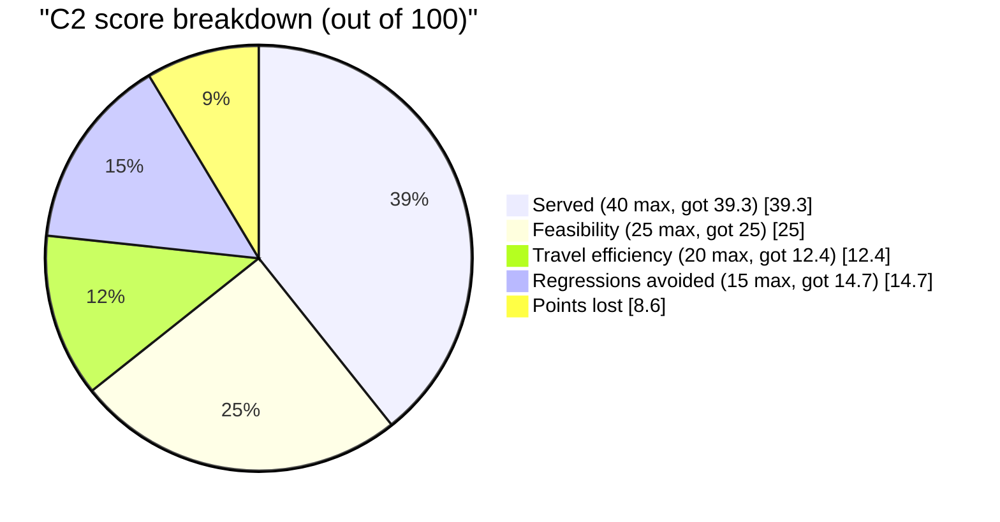

# Multi-Agent Deliberation · Architecture

Static architecture diagrams for the multi-agent optimization pipeline. These render natively on GitHub.

---

## 1. C2 Pipeline (the winner: 3 agents × 2 rounds)

### Reading the diagram

- **Solid arrows** = data flow in the forward pass
- **Dashed arrows** = the round-2 feedback loop (agents re-read the summarized round-1 discussion before speaking again)
- **Colored nodes** = role types (cyan agents, orange utilities, green output)

---

## 2. Two-Round Iteration (sequence view)

---

## 3. Config Grid & Results

**Read it like this:** Round 2 helps at 3 agents (+18), destroys quality at 6 mini agents (−20), helps again at 10 with Opus (+10). Iteration is dose-dependent on agent count and model quality.

---

## 4. Score Composition (how the 76.4 is built)

---

## Notes

- The C2 pipeline (section 1) shows the winning configuration
- The Config Grid (section 3) shows how iteration interacts with agent count
- The sequence diagram (section 2) illustrates the round-2 feedback mechanism
